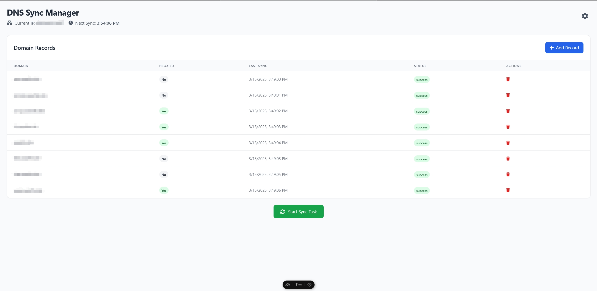

# Cloudflare IP Monitor

A dynamic DNS management tool that automatically updates your Cloudflare DNS records with your machine's current IP address. Perfect for home servers and dynamic IP environments.



## Features

- 🌐 Automatic IP detection and DNS synchronization
- ⚡ Real-time DNS record management (Create, Update, Delete)
- 🔄 Configurable sync interval (1-1440 minutes)
- 🛡️ Cloudflare proxy toggle (Orange Cloud/Proxied vs Direct)
- 📊 Visual status monitoring with sync history
- 🔐 Secure credential storage (local browser storage)

## Installation (docker)

1. Clone the repository

```bash
git clone https://github.com/swarfte/cloudflare-ip-monitor.git
```

2. Navigate to the project directory

```bash
cd cloudflare-ip-monitor
```

3. Build the Docker image

```bash
docker build -t cloudflare-ip-monitor .
```

4. run the Docker container

```bash
docker run -d \
  --name cloudflare-ip-monitor \
  -p 8123:8123 \
  -e PORT=8123 \
  cloudflare-ip-monitor
```

## Installation (nodejs)

1. Clone the repository

```bash
git clone https://github.com/swarfte/cloudflare-ip-monitor.git
```

2. Navigate to the project directory

```bash
cd cloudflare-ip-monitor
```

3. Install dependencies

```bash
npm install
```

4. Create .env file to set the port

```env
PORT=8123
```

5. Run the application

```bash
npm run build
npm run preview
```

## Configuration

1. Get your Zone ID from Cloudflare dashboard
2. Create API token with:
   - Permissions: Zone -> DNS -> Edit
   - Zone Resources: Include -> All zones
   - [Create API token guide](https://developers.cloudflare.com/fundamentals/api/get-started/create-token/)

## Usage

1. Initial Setup

   - Click the gear icon ⚙️ to configure Cloudflare credentials
   - Set your preferred sync interval (default: 5 minutes)

2. Manage DNS Records

   - Click "+ Add Record" to create new A records
   - Toggle proxy status with the cloud icon
   - Delete records using the trash can icon 🗑️

3. Automatic Syncing

   - Click "Start Sync Task" to begin automatic updates
   - Current IP and next sync time shown in header

4. Manual Operations
   - Force immediate sync using the "Start Sync Task" button
   - Monitor sync status through color-coded indicators:
     - 🟢 Success | 🔴 Failed | ⚪ Not synced

## Technologies

- Frontend: Vue.js 3 + Nuxt.js
- UI Framework: Tailwind CSS
- Cloudflare API Integration
- IP Detection Service: icanhazip.com

## Contributing

Contributions welcome! Please follow these steps:

1. Fork the repository
2. Create feature branch (git checkout -b feature/your-feature)
3. Commit changes (git commit -m 'Add some feature')
4. Push to branch (git push origin feature/your-feature)
5. Open a pull request

## License

This project is licensed under the MIT License. See the [LICENSE](LICENSE) file for details.

## Acknowledgements

- [Cloudflare API Documentation](https://developers.cloudflare.com/api/)
- [Vue.js](https://vuejs.org/)
- [Nuxt.js](https://nuxtjs.org/)
- [Tailwind CSS](https://tailwindcss.com/)
- [icanhazip.com](https://icanhazip.com/)

## Disclaimer

This project is for educational purposes only. Use at your own risk. The author is not responsible for any data loss or damage caused by the use of this software. This project is not affiliated with Cloudflare, Inc. Use at your own responsibility.
